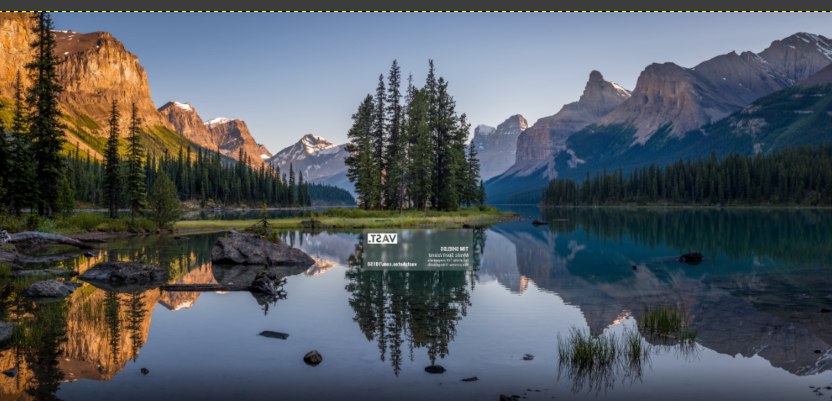
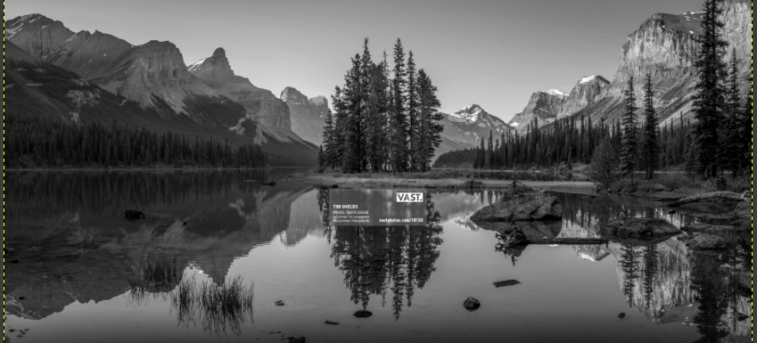
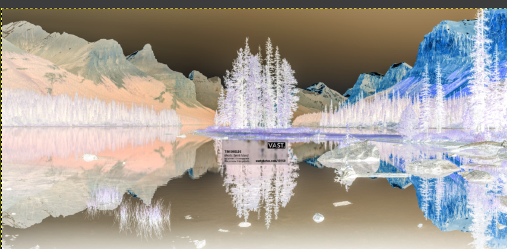
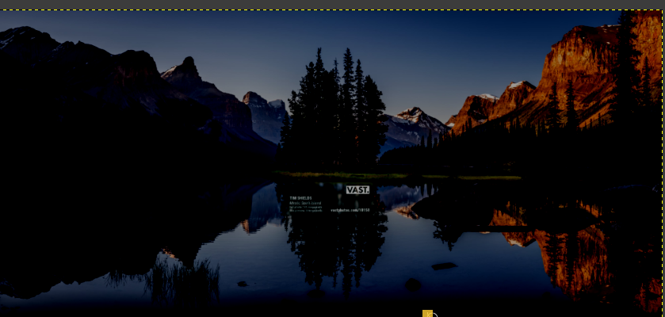

# Raw Image Editor (C++)

A command-line image editor built entirely in **core C++** — no external image libraries, no STL algorithms beyond `vector` and `swap`. It reads raw pixel data from PPM image files, applies filters, and writes the result back to disk.

## Why this project

Most beginner C++ portfolios are full of to-do apps and calculators. This project is different — it works directly with **raw pixel data**, which means understanding memory, file formats, and low-level data handling. The output is a real, visible image, not just console text.

## Features

- **Load / Save** — reads and writes PPM (P3, ASCII) image files
- **Grayscale** — converts the image to black & white using a weighted luminance formula
- **Invert** — creates a photo-negative effect
- **Brightness** — brightens or darkens the image, with overflow protection (clamping)
- **Flip Horizontal** — mirrors the image left-to-right
- Menu-driven interface — apply multiple filters in a single run before saving

## How it works

An image is just a grid of numbers. Every pixel has three values — Red, Green, Blue (0–255) — and combining them produces any color. This program:

1. Opens a `.ppm` file and reads its header (format tag, width, height, max color value)
2. Loads every pixel's R, G, B values into memory
3. Applies the filter(s) the user chooses
4. Writes the modified pixel data back out to a new `.ppm` file

## Tech / Concepts used

| Concept | Purpose |
|---|---|
| `ifstream` / `ofstream` | Reading and writing the PPM text format |
| `struct Pixel` | Groups R, G, B into one unit |
| `class Image` (OOP) | Encapsulates image data and filter methods |
| `vector<Pixel>` | Dynamic storage for all pixels, regardless of image size |
| Index math (`y * width + x`) | Converts 2D row/column position into a 1D array index (used for flip) |
| Clamping | Prevents `unsigned char` overflow when adjusting brightness |

No external libraries — everything is built from the C++ Standard Library.

## How to build and run

```bash
g++ image_editor.cpp -o editor
./editor
```

Then follow the prompts:

```
Enter input PPM filename: myphoto.ppm
Loaded 'myphoto.ppm' (800x600, 480000 pixels)

--- Raw Image Editor ---
1. Grayscale
2. Invert
3. Brightness
4. Flip Horizontal
5. Save and Exit
Choice: 1
Applied grayscale.

Choice: 5
Enter output filename: output.ppm
Saved -> output.ppm
```

**Note:** Only ASCII/P3 format PPM files are supported. If you have a JPG/PNG, open it in [GIMP](https://www.gimp.org/) and use **File → Export As**, saving with a `.ppm` extension and choosing **ASCII** when prompted.

## Screenshots

**Original**


**Grayscale**


**Invert**


**Brightness**


**Flip Horizontal**


## What I learned

- How image files actually store pixel data, and how the PPM format works at a byte/text level
- File I/O in C++ using `ifstream`/`ofstream`
- Why `unsigned char` needs to be cast to `int` when reading/printing/writing numeric data
- Integer overflow and why clamping is necessary when doing pixel math
- Converting from standalone functions to an OOP class with encapsulation (private data, public methods)
- Index arithmetic for converting a 2D pixel grid into a flat 1D array

## Possible future improvements

- BMP (binary format) support
- Additional filters: contrast, threshold, rotation
- Support for P6 (binary PPM) for faster processing on large images

## Author

Built from scratch, module by module, as a learning project in core C++.
